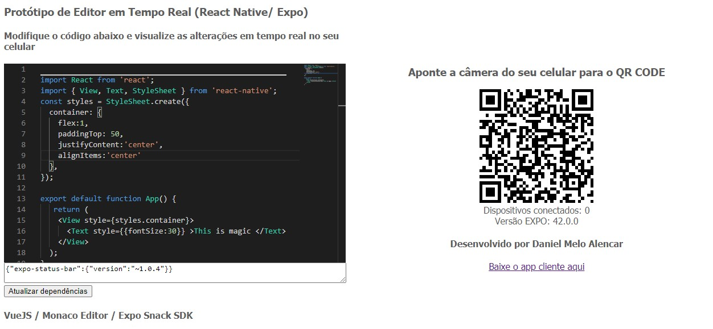

# VueJS + Monaco Editor + Expo Snack SDK [](https://www.codacy.com/gh/danielmeloalencar/vue-monaco-expo-snack-sdk/dashboard?utm_source=github.com&amp;utm_medium=referral&amp;utm_content=danielmeloalencar/vue-monaco-expo-snack-sdk&amp;utm_campaign=Badge_Grade)

## Este projeto é parte de um projeto maior

<!---Esses são exemplos. Veja https://shields.io para outras pessoas ou para personalizar este conjunto de escudos. Você pode querer incluir dependências, status do projeto e informações de licença aqui--->



> Não é necessário instalar Expo, React Native, Android Studio nem Android SDK

> Atualiza o app no celular em tempo real (Hot Reload)

> Atualiza as dependências em tempo real, inclusive as sub-dependências

> Gera link para download do projeto completo em pasta compactada. O link é gerado apenas no console, pois não havia necessidade de criar uma UI para isso.

## 💻 Pré-requisitos

Antes de começar, verifique se você atendeu aos seguintes requisitos:
<!---Estes são apenas requisitos de exemplo. Adicionar, duplicar ou remover conforme necessário--->
* `Node`


## 🚀 Instalando o projeto

Para instalar, siga estas etapas:

Windows / Linux:
```
$ npm install 
```


## ☕ Rodando o projeto

Para rodar, siga estas etapas:

```
npm run serve
```

Para compilar, siga estas etapas:

```
npm run build
```

## 📫 Contribuindo para Eagle IDE
<!---Se o seu README for longo ou se você tiver algum processo ou etapas específicas que deseja que os contribuidores sigam, considere a criação de um arquivo CONTRIBUTING.md separado--->
Para contribuir com Eagle IDE, siga estas etapas:

1. Fork it!
2. Crie um branch: `git checkout -b my-new-feature`.
3. Faça suas alterações e confirme-as: `git commit -am 'Add some feature'`
4. Envie para o branch original: `git push origin my-new-feature`
5. Envie uma pull request.

Como alternativa, consulte a documentação do GitHub em [como criar uma solicitação pull](https://help.github.com/en/github/collaborating-with-issues-and-pull-requests/creating-a-pull-request).

## 🤝 Colaboradores

Agradecemos às seguintes pessoas que contribuíram para este projeto:

<table>
  <tr>
      <td align="center">
      <a href="#">
        <br>
        <sub>
          <b>Daniel Melo Alencar</b>
        </sub>
      </a>
    </td>
  </tr>
</table>


## 😄 Seja um dos contribuidores<br>


